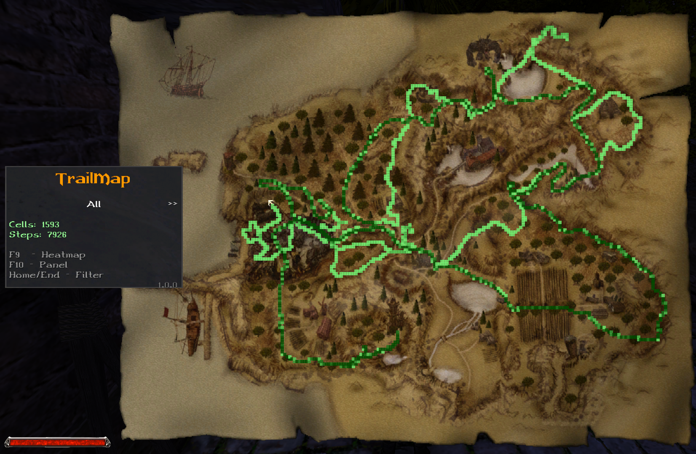

# TrailMap - Union Plugin [Gothic I/G1A/G2/G2NotR]
TrailMap is a Union plugin for Gothic I/G1A/G2/G2NotR that creates a heatmap overlay on the in-game map showing where you've been. The plugin tracks your movement and displays visited areas with color-coded markers, helping you explore the world more efficiently and visualize your journey through each chapter.
This plugin is based on [ItemMap](https://github.com/Sefaris/ItemMap) by Sefaris.

https://www.youtube.com/watch?v=iu_8aKg0qiU

## Features

- **Real-time Movement Tracking**: Automatically records your position as you explore the world
- **Heatmap Visualization**: Color-coded markers show visited areas (light green = few visits, dark green = many visits)
- **Chapter-based Filtering**: View trails from specific chapters or all chapters combined
- **Step Counter**: Tracks total steps taken per chapter
- **Persistent Data**: Trail data is saved with each savegame in TRAILMAP.SAV file
- **Customizable Grid**: Adjustable cell size and color intensity
- **Multi-Game Support**: Compatible with Gothic I Classic, Gothic I Addon, Gothic II Classic, Gothic II NotR
- **Union Menu Integration**: Configure all settings directly from Union menu

## Installation

1. Download the latest release from the [Releases](../../releases) page
2. Extract `TrailMap.vdf` to your `[Gothic]\Data\Plugins` folder
3. Launch Gothic - the plugin will load automatically

## Usage

### Basic Controls
- **Open Map**: Press your map key (default: M)
- **F9**: Toggle heatmap overlay on/off
- **F10**: Toggle info panel on/off
- **Home/End**: Cycle through chapter filters

### Filter Options
The plugin offers several filtering modes accessible via Home/End keys:
- **All**: Show trails from all chapters
- **Current**: Show only trails from current chapter
- **Chapter 1-9**: Show trails from specific chapter
- **Off**: Hide all trails

The filter automatically skips chapters higher than your current chapter (e.g., if you're in Chapter 3, only All, Current, Ch1, Ch2, Ch3, and Off are available).

### Info Panel
The left panel displays:
- **Cells**: Number of unique grid cells visited
- **Steps**: Total steps taken (per chapter)
- **Current Filter**: Active filter mode
- **Keybindings**: Quick reference for controls

## Configuration

### Through Union Menu (Recommended)

1. Launch the game
2. Go to Main Menu → Options → Union
3. Find "TrailMap" in the list
4. Configure options:
   - **Enabled**: Toggle the plugin on/off
   - **GridSize**: Size of tracking cells in game units (default: 1000)
   - **MaxVisitsForColor**: Number of visits for maximum color intensity (default: 10)
   - **ShowHeatmap**: Show/hide heatmap markers
   - **ShowPanel**: Show/hide info panel
   - **TransparentPanel**: Make panel semi-transparent

### Configuration Options

| Option | Description | Default | Range |
|--------|-------------|---------|-------|
| `Enabled` | Enable/disable the entire plugin | On | - |
| `GridSize` | Size of grid cells in game units | 1000 | 100+ |
| `MaxVisitsForColor` | Visits needed for darkest color | 10 | 1+ |
| `ShowHeatmap` | Display heatmap overlay | On | - |
| `ShowPanel` | Display info panel | On | - |
| `TransparentPanel` | Semi-transparent panel | Off | - |

### How It Works

#### Grid System
- The world is divided into grid cells based on `GridSize`
- Each time you move 100 units, your position is recorded
- If you enter a new grid cell, a visit is recorded for that cell in the current chapter
- Cells can be visited multiple times, increasing their color intensity

#### Color Coding
- **Transparent**: Never visited
- **Light Green**: Few visits (1-2)
- **Medium Green**: Moderate visits (3-5)
- **Dark Green**: Many visits (6-10+)

The color intensity is calculated as: `intensity = visits / MaxVisitsForColor`
- Lower `MaxVisitsForColor` = faster color darkening
- Higher `MaxVisitsForColor` = slower, more gradual color changes

#### Step Counting
- Steps are counted per chapter
- One step = moving 100 game units
- Steps are tracked separately from cell visits
- Useful for speedrunning or tracking exploration efficiency

## Data Storage

### Save Files
Trail data is stored in `[SaveFolder]\TRAILMAP.SAV` for each savegame:
- Uses Gothic's native zCArchiver format (ASCII mode)
- Automatically saved when you save the game
- Automatically loaded when you load a savegame
- Each savegame has independent trail data

### Data Structure
The plugin stores:
- Grid cell coordinates (gx, gz)
- Visit counts per chapter for each cell
- Total step count per chapter
- Grid size used for recording

## Supported Games and Mods

### Base Games
- **Gothic I Classic**: ✅ Supported
- **Gothic I Addon**: ✅ Supported  
- **Gothic II Classic**: ✅ Supported
- **Gothic II NotR**: ✅ Supported

### Popular Mods
- **The Chronicles Of Myrtana: Archolos**: ✅ Supported (9 chapters)
- **Other Total Conversions**: ✅ Supported (up to 9 chapters)
- **Vanilla Mods**: ✅ Supported

## Building from Source

### Prerequisites
- Visual Studio 2019 or later
- Union SDK v1.0m
- C++11 or later

### Build Steps
1. Clone this repository
2. Copy ZenGin folder from Union SDK to `TrailMap/ZenGin/`
3. Open `TrailMap.sln` in Visual Studio
4. Select "MP x4 MT Release" configuration
5. Build the solution
6. Find the compiled DLL in the `Bin/` folder

## Credits

### Development
- **Plugin Author** - [Raster96](https://github.com/Raster96/TrailMap-Union)
- **Union Team** - For the excellent Union SDK framework
- **ItemMap** - For map overlay inspiration and texture assets
- **Gothic Community** - For continued support and testing

## License

MIT License

## Troubleshooting

### Plugin Not Loading
- Ensure `TrailMap.vdf` is in the correct folder: `[Gothic]\Data\Plugins`
- Check that Union is properly installed
- Verify Gothic version compatibility
- Check that texture files are included in the VDF

### Heatmap Not Showing
- Press F9 to toggle heatmap visibility
- Ensure you've moved around enough to record visits
- Check that filter is not set to "Off"
- Verify `ShowHeatmap` is enabled in Union menu

### Panel Not Showing
- Press F10 to toggle panel visibility
- Check that `ShowPanel` is enabled in Union menu
- Ensure you're viewing the map (press M)

### Data Not Saving
- Verify you're saving the game properly (not quick-loading)
- Check that savegame folder has write permissions
- Ensure `Enabled` is On in Union menu
- Look for TRAILMAP.SAV file in your savegame folder

### Performance Issues
- Increase `GridSize` to reduce number of tracked cells
- Disable `ShowPanel` if not needed
- Consider clearing old trail data by starting a new game

### Textures Not Loading
- Ensure TRAILMAP_BACKGROUND.TGA and TRAILMAP_MARKER.TGA are in the VDF
- Check that textures are in `_work/Data/Textures/_compiled/` folder
- Verify texture files are compiled (.TEX format)

## Contributing

This is a community project. Feel free to:
- Report bugs in the [Issues](../../issues) section
- Submit improvements via Pull Requests
- Share feedback and suggestions
- Test with different Gothic versions and mods
- Discord: raster96

## Version History

- **v1.0.1** - Dynamic cell sizing & texture rename
  - Heatmap dot size is now calculated dynamically from the world-to-map ratio
  - Cells display correctly on all maps (world, city, custom mod maps)
  - Eliminated gaps between adjacent cells on CoM and rotated maps
  - Removed obsolete DotSize setting from Union menu
  - Renamed textures from ITEMMAP_* to TRAILMAP_* to avoid conflicts with ItemMap plugin
- **v1.0.0** - Initial release
  - Real-time movement tracking
  - Chapter-based filtering with smart chapter detection
  - Heatmap visualization with color intensity
  - Per-chapter step counter
  - Persistent data storage in savegames
  - Union menu integration
  - Customizable grid size and colors
  - Support for all Gothic versions and mods

---
